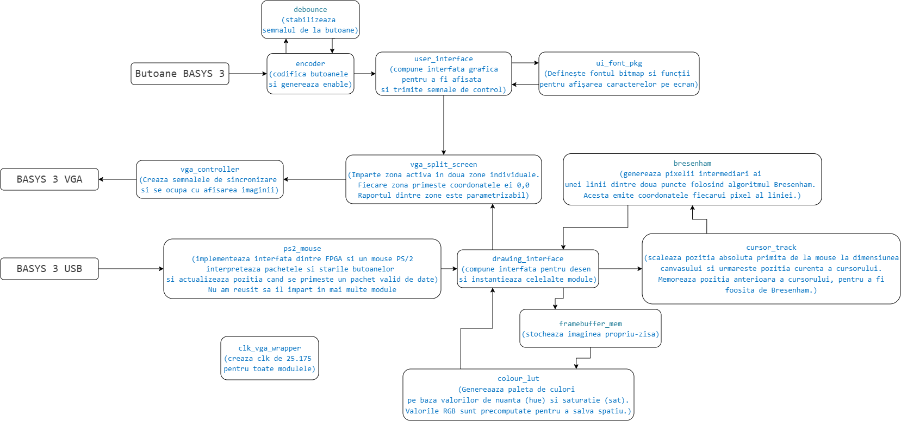

# Etch_a_Sketch_on_BASYS3

Autor Orheanu Stefan - Bogdan

# Revizii
| Revizie   | Data          | Comentarii                                                                             |
| :---      | :----         | :---                                                                                   |
| 0.1       | 07.07.2026    | Definirea obiectivelor pentru proiect                                                 |
| 0.2       | 10.07.2026    | Extinderea obiectivelor, finalizarea vga_controller si testarea acestuia              |
| 0.3       | 20.07.2026    | Actualizarea etapelor conform modulelor implementate, adaugarea etapei de memorie     |
| 0.4       | 20.07.2026    | Eliminarea etapei de crestere a rezolutiei, completarea sectiunilor de dificultati si mod de dezvoltare |
| 0.5       | 22.07.2026    | Adaugarea memoriei de cadre (framebuffer), redenumirea bridge.sv in encoder.sv, eliminarea gumei (eraser), a reset-ului de canvas si a suportului pentru mouse din scop |
| 0.6       | 23.07.2026    | Adaugarea comentariilor pentru porturi si parametri in toate modulele, integrarea modulului ps2_mouse in top.sv, adaugarea etapei 12 (mouse PS/2) si documentarea incercarii nereusite de impartire a acestuia |

## Cuprins

- [Etch\_a\_Sketch\_on\_BASYS3](#etch_a_sketch_on_basys3)
- [Revizii](#revizii)
  - [Cuprins](#cuprins)
  - [Introducere](#introducere)
  - [Structura proiectului](#structura-proiectului)
  - [Obiective principale](#obiective-principale)
  - [Etapele proiectului](#etapele-proiectului)
    - [1. Definirea obiectivelor](#1-definirea-obiectivelor)
    - [2. Proiectare Controller VGA si simulare](#2-proiectare-controller-vga-si-simulare)
    - [3. Implementare pe FPGA a Controller VGA](#3-implementare-pe-fpga-a-controller-vga)
    - [4. Test Controller VGA](#4-test-controller-vga)
    - [5. Interfata de butoane (debounce si control)](#5-interfata-de-butoane-debounce-si-control)
    - [6. Impartirea ecranului in doua zone](#6-impartirea-ecranului-in-doua-zone)
    - [7. Miscarea cursorului](#7-miscarea-cursorului)
    - [8. Marirea, micsorarea si schimbarea formei cursorului](#8-marirea-micsorarea-si-schimbarea-formei-cursorului)
    - [9. Selectia culorii](#9-selectia-culorii)
    - [10. Interfata indicator de culoare](#10-interfata-indicator-de-culoare)
    - [11. Adaugarea memoriei pentru canvas](#11-adaugarea-memoriei-pentru-canvas)
    - [12. Adaugarea mouse-ului PS/2](#12-adaugarea-mouse-ului-ps2)
  - [Dificultati generale](#dificultati-generale)
  - [Concluzii](#concluzii)
  - [Hardware](#hardware)

## Introducere

Un Etch-A-Sketch digital/program de desen asemanator cu Krita, realizat in SystemVerilog pentru placa Basys 3, afisat in timp real prin VGA. Utilizatorul poate sa schimbe culoarea (nuanta si saturatie), sa deseneze cu un cursor de forma si marime variabila, si sa controleze cursorul fie cu butoanele placii, fie cu un mouse PS/2. Desenul ramane persistent pe canvas datorita memoriei de cadre.

## Structura proiectului
 
_top.sv_ este fisierul de varf: instantiaza ceasul, driver-ul pentru mouse, cele doua zone de continut (panou UI si canvas de desen) si lantul de afisare VGA.
 

 

## Obiective principale

**Obiective proprii** — De invatat cum se implementeaza si se utilizeaza o placa FPGA si metode de optimizare.

**Obiective proiect** — De realizat o plansa de desen asemanatoare unui Etch-A-Sketch/Krita.

## Etapele proiectului

- [x] 1. **Definirea obiectivelor** — Definirea scopului proiectului.
- [x] 2. **Proiectare Controller VGA si simulare** — Simularea unui semnal VGA la rezolutia 640x480 60Hz.
- [x] 3. **Implementare pe FPGA a Controller VGA** — Afisarea culorilor pe monitor.
- [x] 4. **Test Controller VGA** — Afisarea unui patrat care se misca, pentru a testa functionalitatile.
- [x] 5. **Interfata de butoane (debounce si control)** — Debounce si detectie de front pentru butoanele placii, plus generarea semnalelor de control pentru UI.
- [x] 6. **Impartirea ecranului in doua zone** — Impartirea afisajului activ intr-o zona de UI (panou de unelte) si o zona de desen (canvas).
- [x] 7. **Miscarea cursorului** — Mutarea cursorului pe canvas folosind butoanele de pe placa.
- [x] 8. **Marirea, micsorarea si schimbarea formei cursorului** — Modificarea marimii cursorului (patrat/cerc) din panoul de unelte.
- [x] 9. **Selectia culorii** — Selectarea culorii curente prin nuanta (hue) si saturatie, folosind un LUT de culori.
- [x] 10. **Interfata indicator de culoare** — Panou UI cu text si pictograme care afiseaza culoarea curenta, forma si marimea cursorului.
- [x] 11. **Adaugarea memoriei pentru canvas** — Un buffer de cadre (framebuffer) care retine ce a fost desenat, astfel incat liniile trasate raman pe ecran.
- [x] 12. **Adaugarea mouse-ului PS/2** — Integrarea unui mouse PS/2 pentru controlul cursorului si desenare pe canvas.

### 1. Definirea obiectivelor

La finalul proiectului, doresc sa am un canvas si interfete pentru utilizator care afiseaza culoarea curenta, marimea cursorului si o radiera pentru a sterge o portiune.

### 2. Proiectare Controller VGA si simulare

**Obiectiv**

Verificarea functionala a modulului _vga_controller.sv_ inainte de sinteza, pentru a confirma corectitudinea semnalului generat.

**Metoda de realizare**

Verificarea modulului _vga_controller.sv_ cu un testbench prestabilit, care a verificat rezolutia, culoarea si cazul de reset in timpul afisarii imaginii.

**Dificultati**

Exemplul gasit pe internet a fost eronat, ceea ce m-a obligat sa rescriu aproape in intregime modulul _vga_controller_.

**Mod de dezvoltare**

Am utilizat Vivado si un testbench standard, rulat pana cand simularea s-a terminat fara erori.

### 3. Implementare pe FPGA a Controller VGA

**Obiectiv**

Generarea semnalului VGA fizic la frecventa corecta, pentru a putea afisa imaginea pe monitor prin portul VGA al placii.

**Metoda de realizare**

Am adaugat un _clk_wiz_ setat la 25.175MHz, usor de modificat separat de restul proiectului. Am creat un fisier _top_ in care am instantiat _clk_vga_wrapper_ si _vga_controller_.

**Mod de dezvoltare**

Constrangerile au fost preluate de pe site-ul Digilent si adaugate manual in proiect.

### 4. Test Controller VGA

**Obiectiv**

Testarea functionala a iesirii VGA pe monitor, folosind un patrat care se misca pe tot ecranul pana intalneste o margine.

**Metoda de realizare**

Am realizat modulul _moving_square_gen_, care genereaza un patrat ce se misca pana intalneste o margine.

**Dificultati**

Patratul nu se misca din pozitia 0,0. Am rezolvat asta stocand pozitia curenta in variabila _next_dir_y_.

**Mod de dezvoltare**

Am reincarcat design-ul pe placa in mod repetat, pana am obtinut comportamentul dorit. Modulul ramane in proiect ca test independent, desi instantierea lui in _top.sv_ este comentata in favoarea modulului _drawing_interface_.

### 5. Interfata de butoane (debounce si control)

**Obiectiv**

Eliminarea zgomotului mecanic al butoanelor placii si transformarea apasarilor in pulsuri de control de un ciclu de ceas.

**Metoda de realizare**

Modulul _debounce.sv_ sincronizeaza semnalul brut printr-un sincronizator pe 2 bistabile si il stabilizeaza cu un numarator de 18 biti (~10.4 ms la 25.175 MHz). Modulul _encoder.sv_ (redenumit din _bridge.sv_) instantiaza cate un _debounce_ pentru fiecare buton, detecteaza fronturile crescatoare si genereaza:
- _enable_, comutat de btnC, care alterneaza intre modul UI si modul desen;
- magistrala _ctrl[2:0]_, care codifica directia apasata, pentru navigarea in panoul de unelte.

**Dificultati**

Fara debounce, o singura apasare era interpretata ca mai multe tranzitii, ceea ce facea comutarea intre UI si desen sa sara peste stari. A trebuit sa gasesc un numar de biti de debounce suficient de mare cat sa filtreze zgomotul, dar destul de mic cat butoanele sa raspunda instant.

**Mod de dezvoltare**

Am modificat codul si am incarcat design-ul pe placa Basys 3 pentru a testa comportamentul real al butoanelor.

### 6. Impartirea ecranului in doua zone

**Obiectiv**

Separarea afisajului activ intr-o zona de UI si o zona de desen, fiecare cu propriul sistem de coordonate locale.

**Metoda de realizare**

Modulul _vga_split_screen.sv_ imparte latimea activa in doua regiuni verticale (_LEFT_W_ si _RIGHT_W_, dupa procentul _SPLIT_PCT_), separate de o linie de _LINE_W_ pixeli. Genereaza coordonate locale (0,0) pentru fiecare zona si multiplexeaza culoarea finala.

**Dificultati**

Calcularea corecta a coordonatelor locale a fost delicata: latimile in biti ale contoarelor ($clog2) trebuiau calculate separat pentru fiecare zona, altfel coordonatele se suprapuneau la marginea liniei despartitoare.

**Mod de dezvoltare**

Am incarcat design-ul pe placa Basys 3 pentru a verifica vizual daca cele doua zone si linia despartitoare apar corect.

### 7. Miscarea cursorului

**Obiectiv**

Permiterea deplasarii cursorului de desen pe canvas folosind butoanele directionale.

**Metoda de realizare**

In _drawing_interface.sv_, pozitia cursorului (_cursor_x_, _cursor_y_) se actualizeaza o data pe cadru (_frame_tick_), doar cand _enable_ == 0. Butoanele se pot combina pentru miscare pe diagonala, iar pozitia e limitata pentru ca cursorul sa nu iasa din zona de desen.

**Dificultati**

Actualizarea directa pe ceas facea cursorul sa se miste prea repede, asa ca am mutat miscarea pe _frame_tick_. A trebuit sa tin cont si de latimea cursorului (_cursor_width_), nu doar de un pixel, altfel iesea partial din canvas cand era marit.

**Mod de dezvoltare**

Am incarcat design-ul pe placa Basys 3 si am testat miscarea cursorului cu butoanele fizice.

### 8. Marirea, micsorarea si schimbarea formei cursorului

**Obiectiv**

Posibilitatea de a modifica marimea cursorului si forma acestuia (patrat sau cerc).

**Metoda de realizare**

Marimea (_size_cursor_) se ajusteaza din panoul de unelte (item "size", index 3). In _drawing_interface.sv_, forma e determinata prin _cursor_shape_: patratul verifica incadrarea in cutia de delimitare, cercul calculeaza distanta la patrat fata de centru comparata cu raza la patrat. Forma se comuta din panoul de unelte (item "shape", index 2).

**Dificultati**

FPGA-ul nu are inmultire in virgula mobila, asa ca detectia cercului a folosit aritmetica intreaga (dx^2 + dy^2 <= raza^2), cu atentie la latimea de biti ca sa nu apara overflow. Latimea efectiva difera intre patrat si cerc, asa ca am calculat separat _cursor_width_ pentru fiecare forma.

**Mod de dezvoltare**

Am incarcat design-ul pe placa Basys 3 si am verificat pe monitor daca patratul si cercul arata corect la toate marimile.

### 9. Selectia culorii

**Obiectiv**

Selectarea culorii curente a cursorului de desen.

**Metoda de realizare**

In loc de switch-uri RGB, am ales o paleta bazata pe nuanta si saturatie. _colour_lut.sv_ genereaza static o paleta de _NUM_HUES_ x _NUM_SATS_ (16x16 = 256), pornind de la 16 nuante de baza si interpoland spre alb pe masura ce saturatia scade. Nuanta si saturatia se navigheaza din panoul de unelte cu butoanele stanga/dreapta.

**Dificultati**

Planul initial era accesul la intreg spatiul de culoare 4:4:4 (4096 combinatii), dar placa nu are suficienta memorie pentru asta combinat cu restul design-ului. Am trecut la o paleta redusa de 256 de culori. Aceasta decizie a ajutat si la memoria de canvas (etapa 11), unde fiecare pixel salvat are nevoie de doar 8 biti in loc de 12.

**Mod de dezvoltare**

Am incarcat design-ul pe placa Basys 3 si am verificat pe monitor daca paleta arata cum ma asteptam.

### 10. Interfata indicator de culoare

**Obiectiv**

Afisarea unui panou UI care arata culoarea selectata, forma si marimea cursorului, si elementul selectat pentru editare.

**Metoda de realizare**

_user_interface.sv_ deseneaza pixel cu pixel, folosind fontul din _ui_font_pkg.sv_ (5x7), urmatoarele randuri: comutatorul EN, eticheta COLOUR cu o mostra de culoare, saturatia in hex (SAT:hN), si forma/marimea cursorului. Elementul selectat e marcat cu o sageata (>), navigat cu butoanele sus/jos.

**Dificultati**

Inainte de orice, a trebuit sa creez caracterele fontului din _ui_font_pkg.sv_: fiecare litera desenata manual pe o grila de 5x7. A fost lent si repetitiv, mai ales pentru caracterele neobisnuite (":", ">", "h"), unde a trebuit sa incarc design-ul de mai multe ori doar ca sa verific cum arata.

Dupa font, restul UI-ului a fost la fel de laborios: pozitionarea manuala a fiecarui glif, calcularea avansului orizontal (_GLYPH_ADV_), alinierea mostrei de culoare pe latimea textului, si gasirea unui _UI_SCALE_ la care panoul sa incapa fara sa depaseasca ecranul. Am adaugat verificari la elaborare ($fatal) ca sa nu descopar abia dupa sinteza ca UI-ul nu incape.

**Mod de dezvoltare**

Am incarcat design-ul pe placa Basys 3 si am comparat vizual pozitia textului si a elementelor UI.

### 11. Adaugarea memoriei pentru canvas

**Obiectiv**

Adaugarea unui framebuffer care sa retina culoarea fiecarui pixel desenat, astfel incat liniile trasate sa ramana vizibile dupa ce cursorul se muta mai departe.

**Metoda de realizare**

_framebuffer_mem.sv_ e un wrapper peste block RAM, cu un port de scriere si unul de citire (latenta de un ciclu). In _drawing_interface.sv_, memoria e adresata la jumatate din rezolutia reala (_MEM_HORIZ = HORIZONTAL/2_, _MEM_VERT = VERTICAL/2_), deci un pixel memorat = un bloc de 2x2 pixeli fizici. Fiecare pixel salvat ocupa 8 biti (hue+sat), in loc de un cod RGB complet.

O masina de stari (_ST_CLEAR_, _ST_IDLE_, _ST_STAMP_) gestioneaza memoria: _ST_CLEAR_ o umple cu alb la pornire, _ST_IDLE_ asteapta o comanda de desenare, iar _ST_STAMP_ scrie forma curenta a cursorului, pixel cu pixel, folosind aceeasi functie _point_in_shape_ ca la afisarea cursorului live.

**Dificultati**

Bugetul de memorie a fost cea mai mare provocare: la rezolutie completa si 12 biti/pixel, memoria ar fi depasit cu mult resursele placii. O dificultate suplimentara a venit din felul in care rezolutia se imparte in blocuri: zona de desen are o rezolutie "ciudata", care nu se imparte curat in blocuri, iar maparea pe blocuri de memorie a impins consumul peste limita disponibila. Din acest motiv am injumatatit rezolutia de stocare pe fiecare axa, pe langa reducerea la 8 biti/pixel.

O alta dificultate a fost sincronizarea intre scrierea formei cursorului in memorie si citirea simultana pentru afisare, tinand cont de latenta de un ciclu a portului de citire — am introdus un registru de intarziere (_x_d_, _y_d_) ca sa ramana sincronizat cu pixelul citit.

**Mod de dezvoltare**

Am incarcat design-ul pe placa Basys 3 si am desenat manual pe canvas, verificand daca liniile raman pe ecran si daca formele noi se suprapun corect peste ce era deja desenat.

### 12. Adaugarea mouse-ului PS/2

**Obiectiv**

Adaugarea unui mouse PS/2 ca mod de control pentru cursor si pentru comanda de desenare, in plus fata de butoanele placii.

**Metoda de realizare**

Modulul _ps2_mouse.sv_ gestioneaza intreg protocolul PS/2: sincronizarea liniilor _PS2Clk_ si _PS2Data_, trimiterea comenzilor de initilizare (_FF_ pentru reset, _F4_ pentru activare streaming), primirea pachetelor de miscare pe 3 octeti si actualizarea pozitiei absolute (_mouse_xpos_, _mouse_ypos_) si a butoanelor (_mouse_left_, _mouse_right_, _mouse_middle_). In _top.sv_, _mouse_left_ comanda semnalul _draw_enable_, iar coordonatele mouse-ului sunt transmise catre _drawing_interface_. Parametrii de scalare _setmax_x_ si _setmax_y_ sunt pulsati o data la iesirea din reset, iar _setmax_val_ este setat la valoarea maxima pe 12 biti.

**Dificultati**

Initial, mouse-ul PS/2 nu era in scopul proiectului (a fost eliminat in revizia 0.5). Dupa finalizarea etapelor principale am decis totusi sa il adaug. Cel mai mare impediment a fost incercarea de a imparti _ps2_mouse.sv_ in submodule mai mici (de exemplu, interfata fizica PS/2 si masina de stare a protocolului de mouse). Am lucrat aproximativ 2 zile la separarea acestuia, dar dependentele stranse intre ceasul PS/2, numaratoarele de temporizare si starea de initializare au facut ca orice divizare sa introduca blocaje sau erori de sincronizare. Modulul a ramas prin urmare monolit in proiect.

**Mod de dezvoltare**

Am incarcat design-ul pe placa Basys 3, am conectat un mouse PS/2 la portul dedicat si am testat deplasarea cursorului pe canvas, precum si desenarea prin apasarea butonului stang.

## Dificultati generale

1. vga_controller.sv a fost o dificultate din cauza unui exemplu eronat gasit pe internet, care m-a obligat sa il rescriu aproape in intregime.
2. Patratul de test (moving_square_gen) nu se misca din pozitia 0,0 initial, rezolvat prin stocarea pozitiei curente in _next_dir_y_.
3. Memoria limitata pe FPGA a dus la mai multe compromisuri: renuntarea la spatiul complet de culoare 4:4:4, renuntarea la cresterea rezolutiei peste 640x480, si stocarea canvasului la jumatate din rezolutia reala.
4. Crearea caracterelor fontului bitmap (ui_font_pkg.sv) a fost o alta dificultate: fiecare litera desenata manual, bit cu bit, pe o grila de 5x7.
5. Crearea interfetei grafice pixel cu pixel a fost, in general, partea cea mai consumatoare de timp: pozitionarea textului, scalarea si alinierea elementelor a necesitat multe incercari repetate pe placa.
6. Memoria pentru canvas a fost etapa cea mai complexa tehnic: o masina de stari care gestioneaza golirea memoriei, asteptarea si desenarea, toate impartind acelasi port de scriere.
7. Impartirea modulului _ps2_mouse.sv_ in submodule mai mici nu a reusit. Am incercat timp de aproximativ 2 zile sa separ interfata fizica PS/2 de masina de stare a protocolului de mouse, dar dependentele stranse intre ceasul PS/2, numaratoarele de temporizare si starea de initializare au facut ca orice divizare sa produca blocaje sau erori de sincronizare. Modulul a ramas prin urmare monolit in proiect.

## Concluzii

Proiectul si-a atins obiectivul principal: un Etch-A-Sketch digital functional pe placa Basys 3, cu iesire VGA la 640x480@60Hz, impartit intr-o zona de desen si un panou de unelte. Utilizatorul poate muta un cursor patrat sau circular de marime variabila, poate alege culoarea din 256 de combinatii, si poate desena persistent pe canvas datorita memoriei de cadre.

Fata de planul initial, mai multe obiective nu au fost incluse in versiunea finala:
- **Cresterea rezolutiei** la 1024x768, limitata de memoria disponibila.
- **Guma (eraser)** pentru stergerea unei singure portiuni din canvas.

Un obiectiv care nu era prevazut initial, dar a fost adaugat ulterior, este **suportul pentru mouse PS/2**. Modulul _ps2_mouse.sv_ a fost integrat in _top.sv_: butonul stang al mouse-ului controleaza _draw_enable_, iar pozitia cursorului este preluata din _mouse_xpos_ / _mouse_ypos_. Incercarea de a imparti _ps2_mouse.sv_ in submodule mai mici (interfata fizica PS/2 si masina de stari a protocolului) a esuat dupa aproximativ 2 zile de lucru, din cauza interactiunii stranse intre ceasul PS/2, debounce si masina de stare a initializarii. Modulul ramane prin urmare monolit in proiect.

## Hardware

- Placa Digilent **Basys 3** (FPGA Artix-7)
- Monitor compatibil VGA
- Cablu VGA